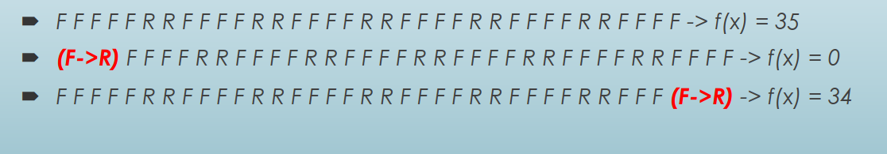
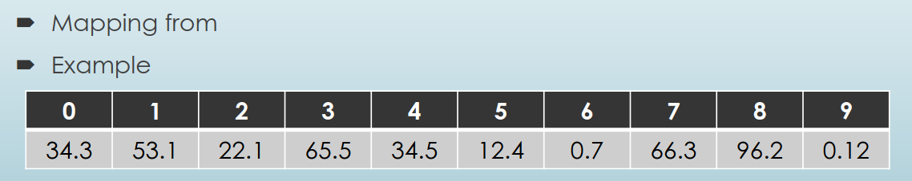

- direct representation: genotype and phenotype are the same (settings on a machine, creating of FSM)
- indirect representation: when evolved values allow for the construction problem's solution (e.g, evolving a program for the solution)
- good representation in EA is crucial: it allows smaller search space and faster search through the space
- epistasis: the actions made in earlier parts of the chromosome having largen impacts that ones in the latter parts:

- indirect real numbered representation (sorting algorithms are fast because no need to worry about ordering)

- epistatic gene is a gene that determines whether or not a trait will be expressed