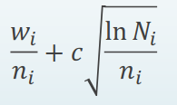

## Algorithm itself

1. Selection: start from root R, select nodes using UCT down to a leaf node L (Upper Confidence Bound 1 applied to trees):   
   
First term is exploitation term, second one is exploration term. The main difficulty is to balance between exploitation of deep variants after moves with high average win rate and exploration of moves with few simulations.  
- w_i is the number of wins of the node after i moves
- n_i is the number of simulations of the node after i moves
- N_i is the number of simulations of the Parent's node after i moves
- c is chosen: e.g, sqrt(2)

2. Expansion  
Unless L ends the game with a win/loss for either player, create one or more child nodes

3. Simulation
Play a random playout from the chosen node C (playout/rollout)

4. Backpropogation  
Use the result to update information of all nodes from C to R

## Misc
- Pros: no eval function ultimate for different tasks, achieves better results than classical algorithms in games with a higher brancing factor, shortens the search time for large tasks
- Cons: there may be very strong moves in some positions but they actually lead to the loss via a subtle line of play
- leaf parallelization (parallel execution of many playouts from given leaf), root parallelization (building independent game trees in parallel), tree parallelization (parallel building of the same game tree, protecting data with mutexes)