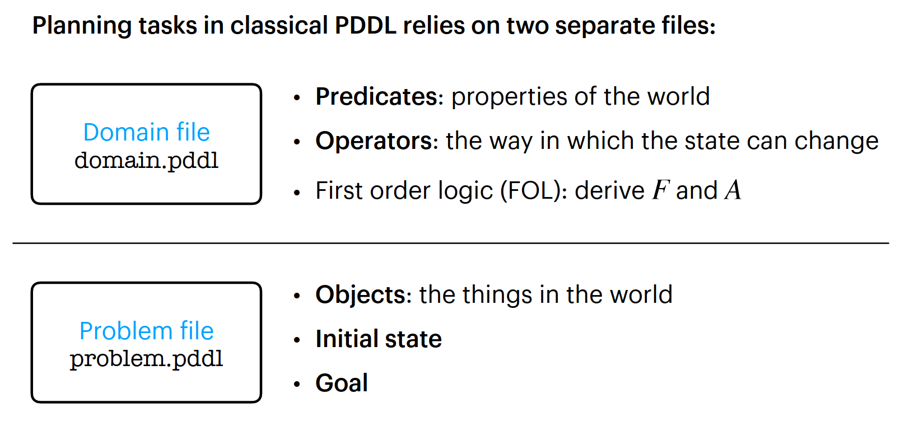
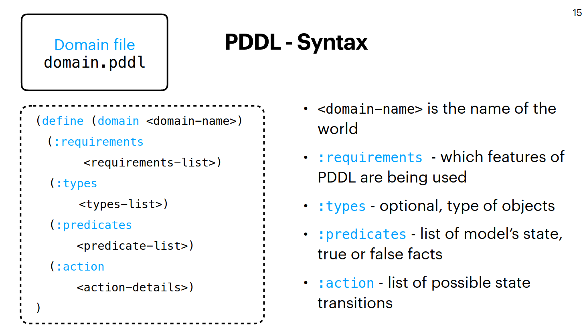
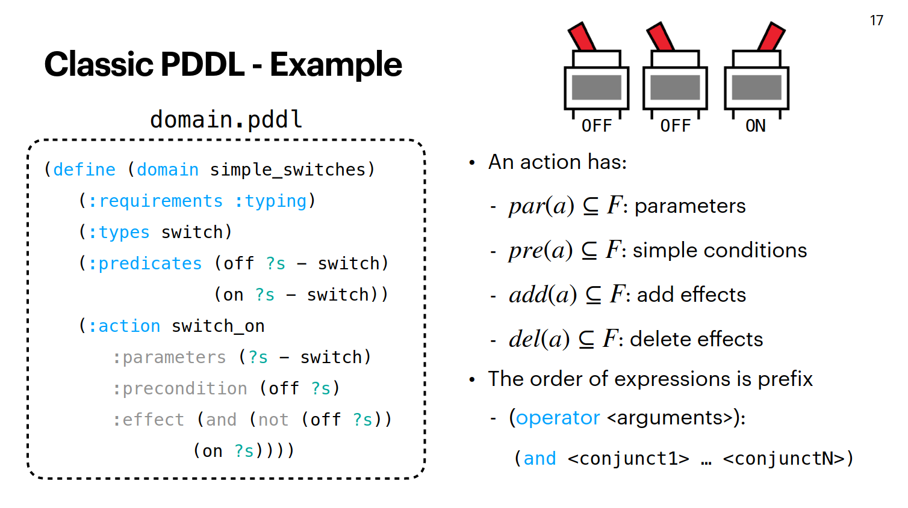
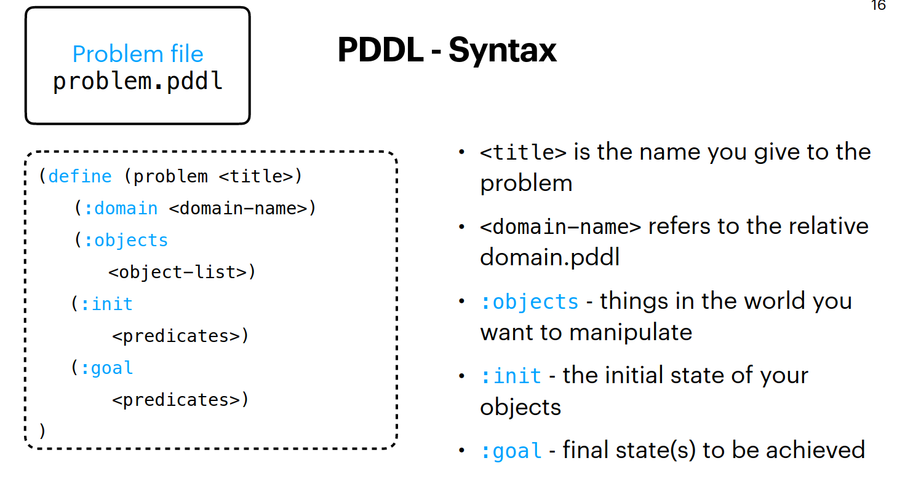
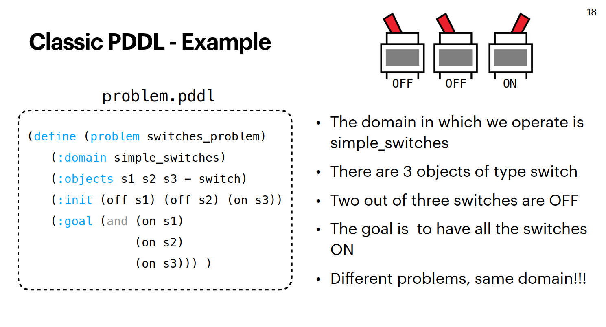
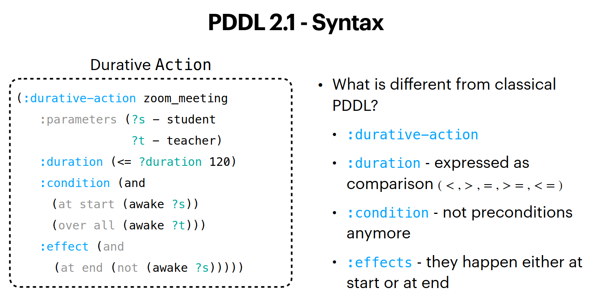

- Planning Domain Definition Language is a framework for formulating and solving planning problem
- Planning is the process of **choosing and scheduling actions** that lead towards a goal, based on a **high-level description** of the world
- Two families of planning approaches:
1. Domain specific planning: methods and representations are specific to a problem (path and motion planning, manipulation planning)
2. Domain independent planning: can be applicable in a lot of domains, has many flavours (discrete/cont, determenistic/non-det, fully/partially observable)

### The classical PDDL planning problem can be described as a tuple <F, A, I, G>  
- F is a set of boolean propositions (facts)
- A is a set of determenistic actions (with preconditions and effects)
- I is an initial state
- G is a goal state
- S is the set of states, S is the power set of F, S=2^(F)

The classical PDDL assumes:
- determenistic/instantaneous actions
- boolean propositions to describe the world
- the world only subject to our actions
- the system is fully observable

### PDDL Structure
   

### Solve PDDL
solvers (MCTS, A*) take as input domain.pddl and problem.pddl and generate a **plan**

## Syntax

Then, we get output in the form of plan!  
switch_on s1  
switch_on s2

---

## PDDL 2.1
- we considered classical planning with instantaneous actions
- we have to model duration and concurrency
- we add V to our tuple, V is a set of real numeric expressions
- now, we have durative actions

